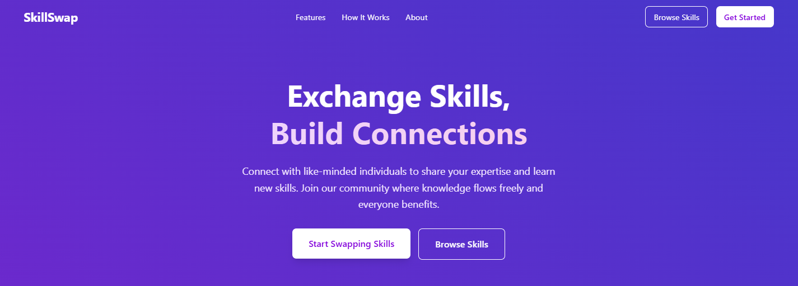

# Skill Swap Platform
A platform designed to connect people who want to learn new skills with those willing to share their expertise. Our goal is to create a space where anyone can learn anything from anyone, anywhere. By listing your skills and requesting to learn others, you become part of a supportive community that grows together, helping each other and expanding horizons.

Key aspects:
- Learn from anyone, anywhere: Break down barriers and access knowledge from a global network
- Share your skills: Teach what you know and help others grow
- Request new skills: Find people who can help you learn something new
- Build a supportive community: Foster connections that encourage personal and collective growth

This platform is about more than just exchanging skills—it's about building a network of people who support and uplift each other, evolving together as lifelong learners.

---

## 🌐 Overview
This project was developed by **Team 1760** as an educational initiative to explore and implement the core components of a modern web application. Our primary goal was to create a robust platform by integrating cutting-edge technologies across the frontend, backend, database, and machine learning domains.

**Project Overview**
We set out to design a full-stack web application that demonstrates how different layers of technology can work together to deliver a seamless user experience. The project emphasizes modularity, scalability, and real-world applicability, encouraging team members to learn and apply best practices in web development.

**Technologies Used**

**Frontend**
- React.js: For building dynamic and responsive user interfaces
- TypeScript: To add static typing and improve code reliability
- CSS Modules: For modular and maintainable styling

**Backend**
- Node.js: To handle server-side logic and API endpoints
- Express.js: For creating RESTful APIs and managing server routes
- Python: Integrated for advanced backend tasks and machine learning model serving

**Database**
- MongoDB: A NoSQL database for flexible data storage and retrieval
- PostgreSQL: Used for structured, relational data management where needed

**Machine Learning Integration**
- Python (scikit-learn, TensorFlow): For developing and training machine learning models
- Flask: To expose machine learning models as REST APIs
- Model Deployment: ML models are trained in Python and integrated into the backend

**Key Learning Outcomes**
- Full-stack Integration: Gained hands-on experience connecting frontend, backend, and database layers
- API Development: Built and consumed RESTful APIs for seamless data flow
- Machine Learning in Production: Learned to incorporate Python-based ML models into a web app
- Collaboration: Enhanced teamwork and code collaboration using modern development workflows

Our vision is to leverage these modern technologies to empower anyone to learn anything from anyone, anywhere, while fostering a supportive, ever-evolving community of learners and contributors.

---

## 👥 Team Members

- **Dhanvi Nautiyal** – [dhanvi.nautiyal78@gmail.com](mailto:dhanvi.nautiyal78@gmail.com)
- **Daksh Gupta** – [dakshgpt12@gmail.com](mailto:dakshgpt12@gmail.com)
- **Anshumaan Gupta** – [anshuman.vinay@gmail.com](mailto:anshuman.vinay@gmail.com)
- **Abhishek** – [abhishek8112003@gmail.com](mailto:abhishek8112003@gmail.com)

---

## ✨ Key Features

- User authentication and profile management
- Skill listing and browsing
- Skill request posting
- Search and filter skills
- Skill exchange matching
- Notifications (email or in-app)
- Responsive UI
- Admin panel for moderation

---

## 🤖 Machine Learning Features

### Intelligent User Matching
- **Jaccard Similarity Scoring**: Advanced algorithm to match users based on skill compatibility
- **Profile Analysis**: Deep learning models analyze user profiles and interaction patterns
- **Dynamic Matching**: Real-time updates to matching scores as user skills evolve
- **Compatibility Metrics**: Multi-dimensional scoring considering skill overlap and complementarity

### Smart Search System
- **Fuzzy Search**: Intelligent search with typo tolerance using Levenshtein distance
- **Auto-complete**: Real-time suggestions as users type
- **Contextual Understanding**: NLP-powered understanding of skill relationships
- **Category Detection**: Automatic skill categorization and grouping

### Learning Path Recommendations
- **Personalized Progression**: AI-driven customized learning roadmaps
- **Market Analysis**: Integration of industry demand data
- **Skill Graph**: Knowledge graph representing skill relationships and dependencies
- **Adaptive Suggestions**: Recommendations that evolve with user progress

---

## 📑 Table of Contents

- [Installation](#installation)
- [Prerequisites](#prerequisites)
- [Setup Instructions](#setup-instructions)
- [Usage](#usage)
- [API Reference](#api-reference)
- [Screenshots](#screenshots)
- [Contributing](#contributing)
- [Testing](#testing)
- [Deployment](#deployment)
- [Troubleshooting](#troubleshooting)
- [FAQ](#faq)
- [Contact](#contact)

---

## 💾 Installation

Clone the repository:

```bash
git clone https://github.com/DakshGupta1204/ODOO.git
cd ODOO
```

Install dependencies:

```bash
# For backend
cd backend
npm install

# For frontend
cd ../frontend
npm install
```

---

## ⚙️ Prerequisites

- Node.js >= 18.x
- npm >= 9.x
- MongoDB Atlas or local MongoDB instance
- (Optional) Docker

---

## 🛠️ Setup Instructions

### Backend Environment Variables

Create a `.env` file inside `backend/`:

```dotenv
PORT=5000
MONGODB_URI=mongodb+srv://<username>:<password>@cluster0.mongodb.net/skillswap?retryWrites=true&w=majority
JWT_SECRET=your_jwt_secret
```

### Frontend Environment Variables

Create a `.env` file inside `frontend/`:

```dotenv
REACT_APP_API_URL=http://localhost:5000/api
```

### Start Backend Server

```bash
cd backend
npm run dev
```

### Start Frontend App

```bash
cd frontend
npm start
```

The application should now be running at http://localhost:3000.

---

## 🚀 Usage

### Basic Usage
- **Sign Up:** Create an account.
- **Profile:** Set up your profile and list your skills.
- **Browse Skills:** Explore other users’ skills.
- **Request Skills:** Post requests for skills you’d like to learn.
- **Match & Chat:** Connect and coordinate swaps.

---


## 📚 API Reference

### Endpoints
**Authentication**
- `POST /api/auth/register`: Register a new user.
- `POST /api/auth/login`: Log in and retrieve token.

**Skills**
- `GET /api/skills`: Get all skill listings.
- `POST /api/skills`: Create a skill listing.
- `GET /api/skills/:id`: Retrieve a single skill.

**Requests**
- `GET /api/requests`: Get all skill requests.
- `POST /api/requests`: Create a skill request.

### Parameters
Example: `POST /api/skills`
```json
{
  "title": "Learn French",
  "description": "Looking for a partner to help me practice conversational French.",
  "category": "Language",
  "exchangeFor": "Guitar lessons"
}
```

---

## 🖼️ Screenshots
Add screenshots here to showcase UI

*Homepage showing the skill matching interface and user dashboard*


---

## 🤝 Contributing

### How to Contribute
1. Fork the repo.
2. Create a feature branch.
3. Commit your changes.
4. Push to your branch.
5. Open a Pull Request.


## 🧪 Testing

### Running Tests
**Backend:**
```bash
cd backend
npm test
```
**Frontend:**
```bash
cd frontend
npm test
```

### Test Coverage
- Jest and Supertest used for backend testing.
- React Testing Library for frontend components.

---

## 🚀 Deployment

Example deployment instructions (Netlify + Heroku):
- **Backend:** Deploy to Heroku.
- **Frontend:** Deploy to Netlify or Vercel.
- **Environment Variables:** Set in respective platform dashboards.

---

## 🛠️ Troubleshooting
| Issue                             | Solution                                         |
|-----------------------------------|--------------------------------------------------|
| MongoDB connection error          | Verify MONGODB_URI credentials and network        |
| Frontend cannot connect to backend| Ensure correct REACT_APP_API_URL and CORS setup  |
| JWT errors                        | Confirm JWT_SECRET matches in all environments    |

---

## ❓ FAQ
**Q: Can I use a different database?**
A: Yes, but you must update the database configuration in `backend/config/db.js`.

**Q: Is there a mobile version?**
A: The web app is responsive, but native apps are planned in the roadmap.

---


## 📬 Contact
For any questions or feedback, please contact the team members listed above.
